# System Architecture Design

## 1. Executive Summary

This document describes the design and architecture of an ESP32-based IoT system for environmental monitoring with TinyML anomaly detection, web-based device control, and cloud integration. The system utilizes FreeRTOS for real-time task management and implements a multi-layered architecture for scalability and maintainability.

## 2. System Overview

### 2.1 Purpose
The system monitors temperature and humidity using a DHT20 sensor, processes data through a TinyML model for anomaly detection, provides visual feedback through LEDs and NeoPixels, displays information on an LCD, and offers remote control capabilities through a web interface and cloud platform (CoreIOT).

### 2.2 Key Features
- **Real-time Environmental Monitoring**: DHT20 sensor for temperature and humidity
- **TinyML Anomaly Detection**: On-device machine learning for identifying abnormal patterns
- **Multi-Mode Operation**: Access Point (AP) mode and Station (STA) mode WiFi connectivity
- **Web Interface**: Modern responsive UI for device control and monitoring
- **Cloud Integration**: CoreIOT platform for data telemetry and remote procedure calls (RPC)
- **Visual Feedback**: LED patterns, NeoPixel colors, and LCD display
- **OTA Updates**: Over-the-air firmware updates via ElegantOTA

## 3. High-Level System Architecture

```mermaid
graph TB
    subgraph "Physical Layer"
        DHT20[DHT20 Sensor<br/>Temperature & Humidity]
        LED1[LED GPIO 2]
        LED2[LED GPIO 4]
        NEO[NeoPixel RGB LED]
        LCD[LCD Display I2C]
        BOOT[Boot Button GPIO]
    end
    
    subgraph "ESP32 Platform"
        subgraph "FreeRTOS Kernel"
            SCHEDULER[Task Scheduler]
            QUEUE[Queue Manager]
            SEMA[Semaphore Manager]
        end
        
        subgraph "Application Tasks"
            SENSOR[Temp/Humi Monitor<br/>Task]
            MANAGER[Manager Task<br/>Decision Engine]
            LED_T[LED Blinky Task]
            NEO_T[NeoPixel Task]
            LCD_T[LCD Display Task]
            TINYML[TinyML Inference<br/>Task]
            WEB[Web Server Task]
            WIFI[WiFi Manager Task]
            COREIOT[CoreIOT Cloud Task]
        end
        
        subgraph "Communication Layer"
            WS[WebSocket Server]
            MQTT[MQTT Client]
            HTTP[HTTP Server]
            DNS[DNS Server<br/>Captive Portal]
        end
        
        subgraph "Storage Layer"
            LITTLEFS[LittleFS<br/>Web Assets]
        end
        
        subgraph "ML Layer"
            TFLITE[TFLite Micro<br/>Interpreter]
            MODEL[Anomaly Detection<br/>Model]
        end
    end
    
    subgraph "Network Layer"
        AP_MODE[WiFi AP Mode<br/>192.168.4.1]
        STA_MODE[WiFi STA Mode<br/>Internet Access]
    end
    
    subgraph "External Systems"
        BROWSER[Web Browser<br/>User Interface]
        CLOUD[CoreIOT Platform<br/>MQTT Broker]
    end
    
    %% Physical connections
    DHT20 -->|I2C Data| SENSOR
    SENSOR -->|SensorSample_t| QUEUE
    QUEUE -->|Distribute| MANAGER
    QUEUE -->|Distribute| TINYML
    
    MANAGER -->|LedPattern_t| LED_T
    MANAGER -->|NeoColor_t| NEO_T
    MANAGER -->|State Update| LCD_T
    MANAGER -->|TelemetryData_t| COREIOT
    
    LED_T -->|Control| LED1
    LED_T -->|Control| LED2
    NEO_T -->|Control| NEO
    LCD_T -->|I2C Display| LCD
    
    TINYML -.->|Anomaly Score| MANAGER
    TFLITE -->|Inference| MODEL
    
    %% Network connections
    WEB -->|Serve Files| LITTLEFS
    WEB -->|WebSocket| WS
    WS -.->|JSON Messages| BROWSER
    
    WIFI -->|Configure| AP_MODE
    WIFI -->|Configure| STA_MODE
    
    AP_MODE -.->|WiFi| BROWSER
    STA_MODE -.->|Internet| CLOUD
    
    COREIOT -->|Telemetry| MQTT
    MQTT -.->|Publish/Subscribe| CLOUD
    
    HTTP -->|OTA Updates| WEB
    DNS -->|Captive Portal| WEB
    
    SCHEDULER -.->|Schedule| SENSOR
    SCHEDULER -.->|Schedule| MANAGER
    SCHEDULER -.->|Schedule| LED_T
    SCHEDULER -.->|Schedule| NEO_T
    SCHEDULER -.->|Schedule| LCD_T
    SCHEDULER -.->|Schedule| TINYML
    SCHEDULER -.->|Schedule| WEB
    SCHEDULER -.->|Schedule| WIFI
    SCHEDULER -.->|Schedule| COREIOT

    style ESP32 Platform fill:#e1f5ff
    style Physical Layer fill:#fff4e6
    style Network Layer fill:#f3e5f5
    style External Systems fill:#e8f5e9
```

## 4. Software Architecture

### 4.1 Layered Architecture

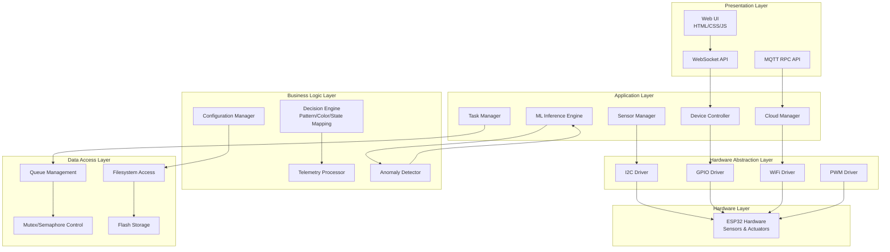

### 4.2 Component Architecture

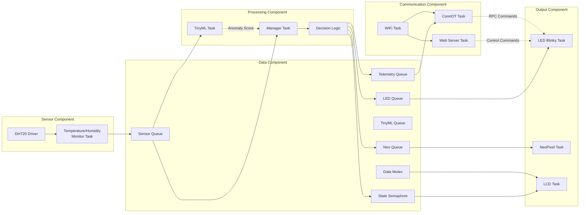

## 5. Task Architecture

### 5.1 FreeRTOS Task Diagram

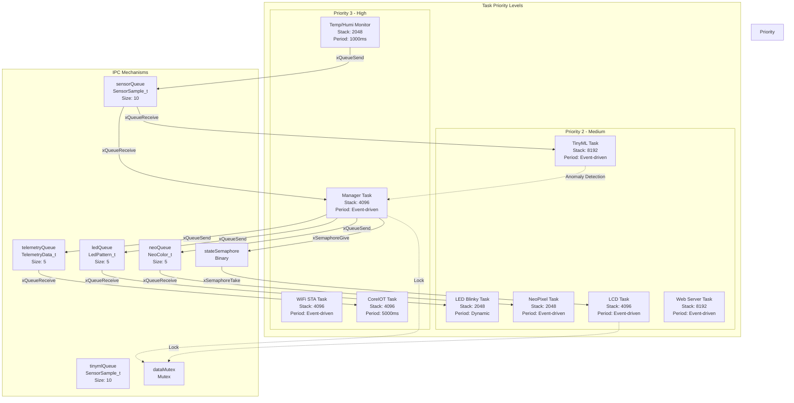

### 5.2 Task Interaction Sequence

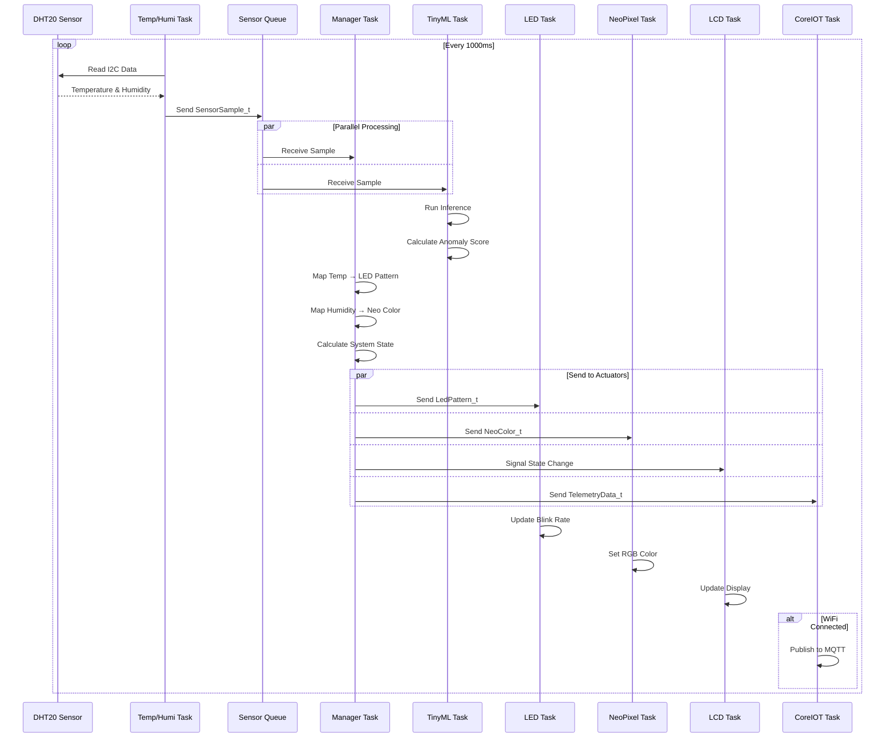

## 6. Data Flow Architecture

### 6.1 Sensor Data Flow

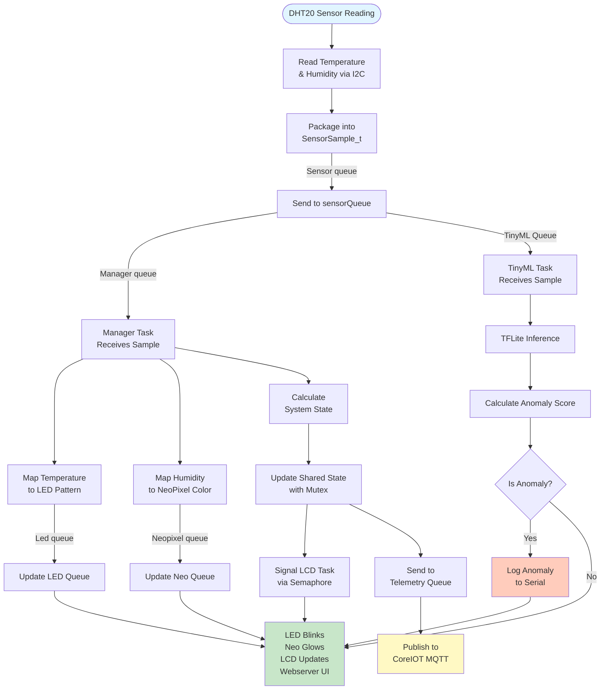

### 6.2 Control Flow (User Commands)

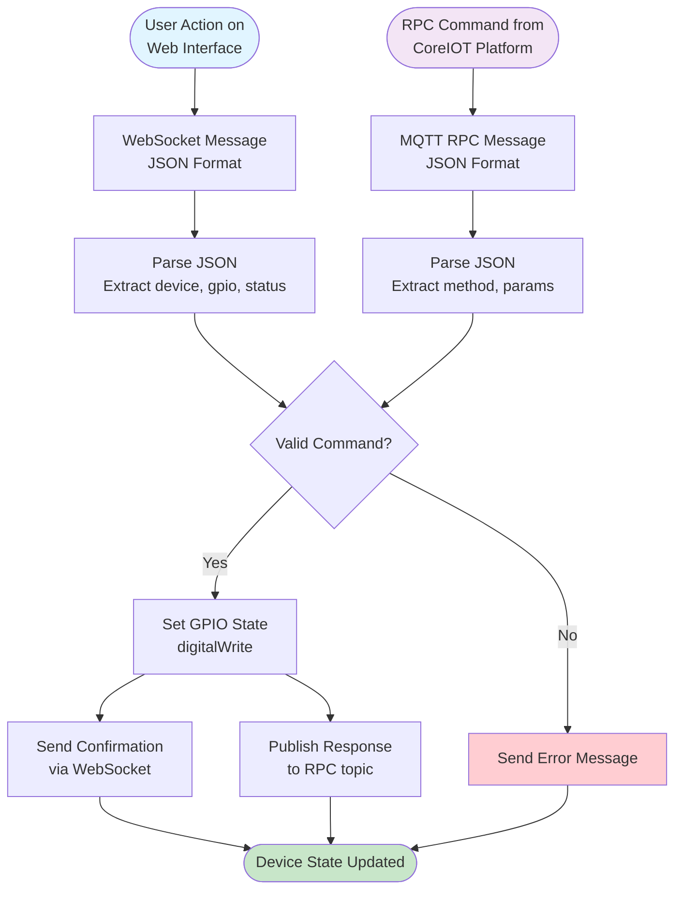

## 7. Network Architecture

### 7.1 WiFi Operation Modes

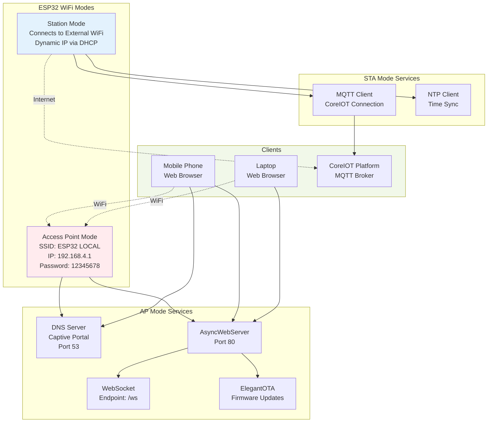

### 7.2 Communication Protocols

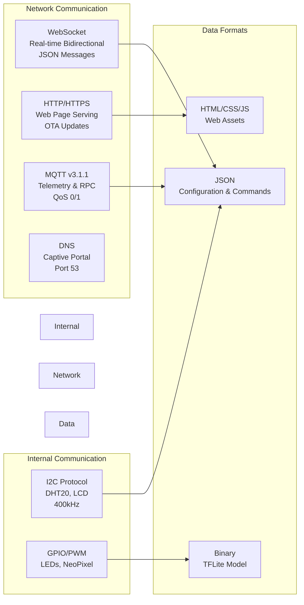

## 8. TinyML Architecture

### 8.1 Machine Learning Pipeline

```mermaid
flowchart LR
    subgraph "Training Phase (Offline)"
        DATASET[HCMC Weather Dataset<br/>CSV Format]
        PREPROCESS[Data Preprocessing<br/>Normalization<br/>Train/Test Split]
        TRAIN[Model Training<br/>Keras/TensorFlow<br/>Autoencoder Architecture]
        CONVERT[TFLite Conversion<br/>Quantization<br/>Optimization]
        MODEL_FILE[dht_anomaly_model.tflite<br/>Embedded in Firmware]
    end
    
    subgraph "Inference Phase (On-Device)"
        SENSOR_DATA[Real-time Sensor Data<br/>Temperature & Humidity]
        NORMALIZE[Input Normalization<br/>Scale to 0, 1]
        TFLITE[TFLite Micro Interpreter<br/>8KB Tensor Arena]
        INFERENCE[Forward Pass<br/>Reconstruction]
        CALCULATE[Calculate MSE<br/>Anomaly Score]
        THRESHOLD{Score > Threshold?}
        NORMAL[Normal State<br/>Continue Monitoring]
        ANOMALY[Anomaly Detected<br/>Log & Alert]
    end
    
    DATASET --> PREPROCESS
    PREPROCESS --> TRAIN
    TRAIN --> CONVERT
    CONVERT --> MODEL_FILE
    
    MODEL_FILE -.->|Embedded| TFLITE
    
    SENSOR_DATA --> NORMALIZE
    NORMALIZE --> TFLITE
    TFLITE --> INFERENCE
    INFERENCE --> CALCULATE
    CALCULATE --> THRESHOLD
    
    THRESHOLD -->|No| NORMAL
    THRESHOLD -->|Yes| ANOMALY
    
    style Training Phase (Offline) fill:#e3f2fd
    style Inference Phase (On-Device) fill:#f1f8e9
    style ANOMALY fill:#ffccbc
```

### 8.2 TinyML Model Architecture

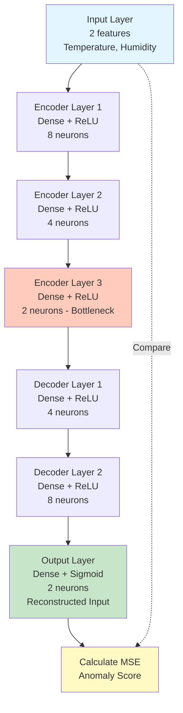

## 9. State Management

### 9.1 System State Machine

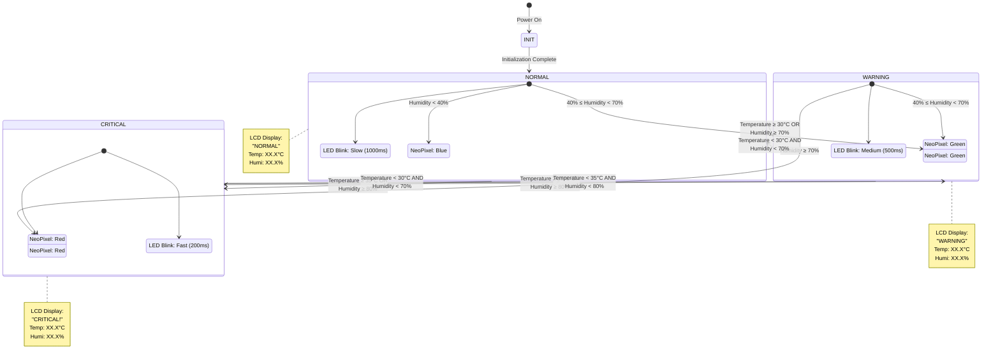

### 9.2 WiFi State Machine

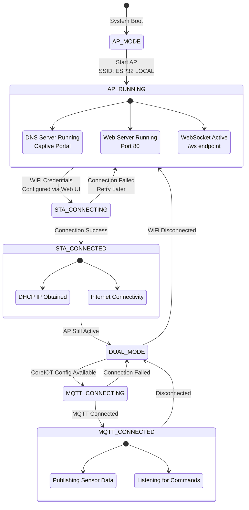

## 10. Security Architecture

### 10.1 Security Layers

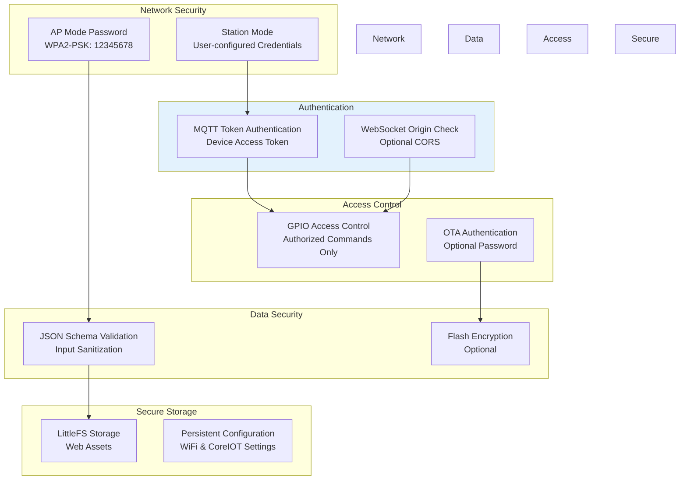

## 11. Data Models

### 11.1 Core Data Structures

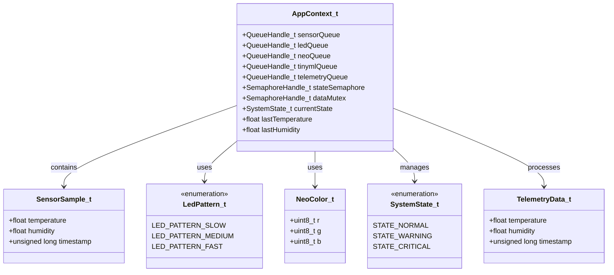

### 11.2 Message Formats

```mermaid
graph TB
    subgraph "WebSocket Messages"
        WS_DEVICE[Device Control<br/>page: device<br/>device: LED1/LED2<br/>gpio: 2/4<br/>status: ON/OFF]
        
        WS_CONFIG[Configuration<br/>page: config<br/>ssid: string<br/>password: string<br/>coreiot_token: string<br/>coreiot_server: string<br/>coreiot_port: string]
        
        WS_STATUS[Status Update<br/>page: device<br/>device: LED1/LED2<br/>status: ON/OFF]
    end
    
    subgraph "MQTT Messages"
        MQTT_TELEM[Telemetry<br/>v1/devices/me/telemetry<br/>temperature: float<br/>humidity: float<br/>timestamp: long]
        
        MQTT_RPC_REQ[RPC Request<br/>v1/devices/me/rpc/request/+<br/>method: string<br/>params: object]
        
        MQTT_RPC_RES[RPC Response<br/>v1/devices/me/rpc/response/{id}<br/>success: boolean<br/>result/error: string]
    end
    
    style WebSocket Messages fill:#e1f5ff
    style MQTT Messages fill:#f3e5f5
```

## 12. Deployment Architecture

### 12.1 System Deployment

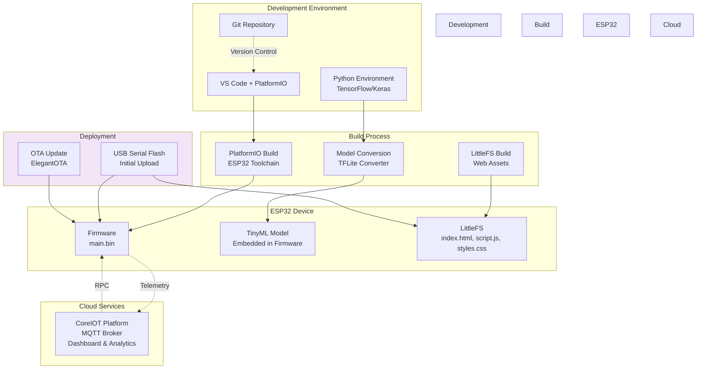

## 13. Performance Considerations

### 13.1 Resource Allocation

| Component | Memory (RAM) | CPU Usage | Priority | Notes |
|-----------|-------------|-----------|----------|-------|
| Manager Task | 4 KB Stack | ~5% | High (3) | Decision engine |
| Sensor Monitor | 2 KB Stack | ~3% | High (3) | Periodic reading |
| TinyML Task | 8 KB Stack + 8 KB Tensor Arena | ~15% | Medium (2) | Inference overhead |
| Web Server | 8 KB Stack | ~10% | Medium (2) | HTTP/WebSocket |
| CoreIOT Task | 4 KB Stack | ~5% | High (3) | MQTT communication |
| LED Tasks | 2 KB Stack each | ~1% | Medium (2) | GPIO control |
| LCD Task | 4 KB Stack | ~2% | Medium (2) | I2C display |
| WiFi Task | 4 KB Stack | ~8% | High (3) | Network management |

### 13.2 Timing Requirements

```mermaid
gantt
    title Task Execution Timeline (1000ms Window)
    dateFormat X
    axisFormat %L ms
    
    section High Priority
    Sensor Read       :0, 50
    Manager Process   :50, 100
    CoreIOT Publish   :100, 150
    WiFi Management   :150, 200
    
    section Medium Priority
    TinyML Inference  :200, 350
    Web Server Handle :350, 400
    LED Update        :400, 420
    NeoPixel Update   :420, 440
    LCD Update        :440, 480
    
    section Idle
    System Idle       :480, 1000
```

## 14. Error Handling & Recovery

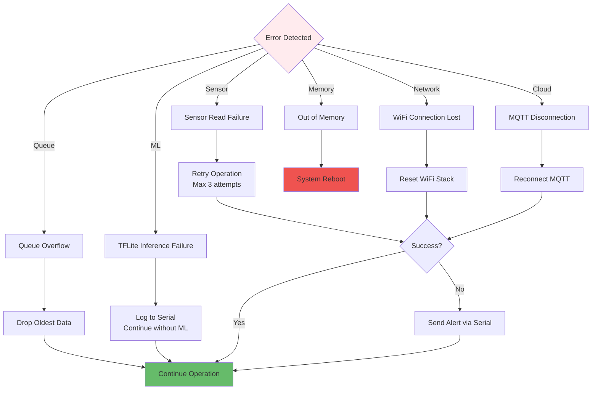

## 15. Future Enhancements

### 15.1 Potential Improvements

1. **Enhanced Security**
   - HTTPS support for web interface
   - Certificate-based MQTT authentication
   - Secure boot and flash encryption

2. **Advanced ML Features**
   - Multiple anomaly detection models
   - Online learning capabilities
   - Predictive maintenance alerts

3. **Extended Connectivity**
   - Bluetooth Low Energy (BLE) support
   - LoRaWAN integration for long-range communication
   - Multi-cloud platform support

4. **User Experience**
   - Mobile application (iOS/Android)
   - Push notifications
   - Historical data visualization
   - User authentication system

5. **Data Management**
   - Local data logging to SD card
   - Time-series database integration
   - Data compression and buffering

6. **Scalability**
   - Multi-device mesh networking
   - Device clustering and coordination
   - Load balancing for multiple clients

## 16. Conclusion

This ESP32-based IoT system demonstrates a comprehensive approach to environmental monitoring with edge AI capabilities. The architecture emphasizes:

- **Modularity**: Clear separation of concerns with FreeRTOS tasks
- **Real-time Performance**: Priority-based task scheduling
- **Scalability**: Queue-based communication for easy expansion
- **Intelligence**: On-device TinyML for anomaly detection
- **Connectivity**: Multi-mode WiFi with web and cloud integration
- **Reliability**: Error handling and recovery mechanisms

The system serves as a robust foundation for IoT applications requiring sensor monitoring, edge computing, and remote control capabilities.
